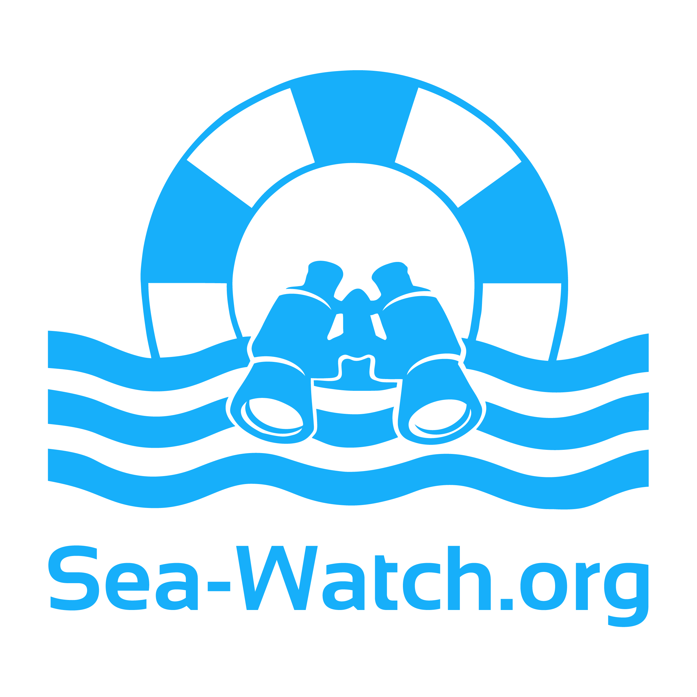

<div style="display: flex; align-items: center">
  <a href="https://sar-psychosupport.org" target="_blank">
    
  </a>
  used by
  <a href="https://sea-watch.org" target="_blank">
   
  </a>
  <a href="https://resqship.org" target="_blank">
    
  </a>
  <a href="https://mare-go.de" target="_blank">
    
  </a>
  <br/><br/>
</div>

Swlkup is an application to manage a database of supervisors and provide anonymous access for authorized users.

## Quickstart

### Prebuild jar

If you don't want build it yourself, you can [download a prebuild jar](https://github.com/johannesloetzsch/swlkup/releases/latest) and run it with:

```bash
java -jar swlkup.jar
```

### Nix

The easiest way to start a reproducible build of the fullstack application, is calling the [`nix Flake`](https://nixos.wiki/wiki/Flakes):

```bash
## Current version from github, without need of checking it out yourself:
nix run github:johannesloetzsch/swlkup/master

## From the toplevel directory of a local checkout:
nix run
```

### Docker

If you don't have `nix`, you can run it in a docker container:

```bash
## Current version from dockerhub and github, without need of checking it out yourself:
docker run -ti -v nix:/nix/ -p 4000:4000 johannesloetzsch/nix-flake nix run github:johannesloetzsch/swlkup/master

## From the toplevel directory of a local checkout:
docker build -t swlkup . && docker run -ti -v nix:/nix/ -p 4000:4000 swlkup
```

### Leiningen + Npm

Alternatively you can start the backend and frontend separately as described in the according directories.
